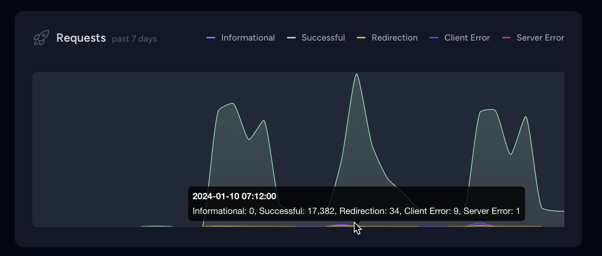

# Laravel Pulse Request Recorder

[](https://packagist.org/packages/chrysanthos/pulse-requests)
[](https://github.com/chrysanthos/pulse-requests/actions?query=workflow%3A"Fix+PHP+code+style+issues"+branch%3Amain)
[](https://packagist.org/packages/chrysanthos/pulse-requests)

This package lets you set up an OTP verification process upon user login.

## Installation

You can install the package via composer:

```bash
composer require chrysanthos/pulse-requests
```

## Usage

Add the card to your dashboard by editing `resources/views/vendor/pulse/dashboard.blade.php`
```php
<x-pulse>
    <livewire:requests cols="8"/>
    
    (...)
</x-pulse>
```
Add the recorder to your `config/pulse.php` file
```php
'recorders' => [
    \Chrysanthos\PulseRequests\Recorders\RequestRecorder::class => [],
    (...)
]
```

## Changelog

Please see [CHANGELOG](CHANGELOG.md) for more information on what has changed recently.

## Security Vulnerabilities

Please contact me directly via email.

## Credits

- [Chrysanthos Prodromou](https://github.com/chrysanthos)
- [All Contributors](../../contributors)

## License

The MIT License (MIT). Please see [License File](LICENSE.md) for more information.
